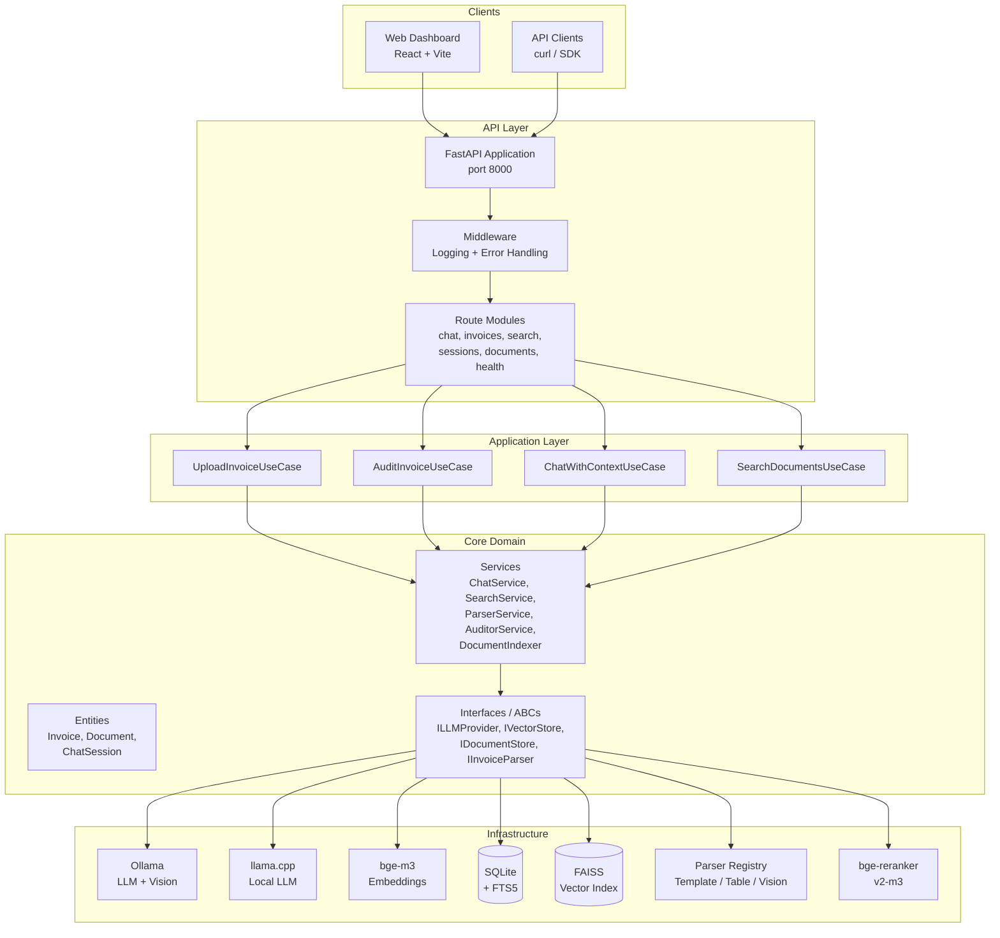
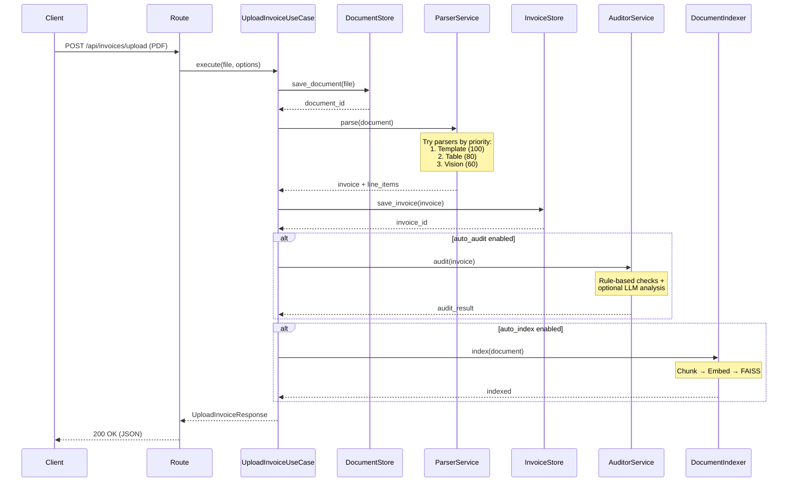
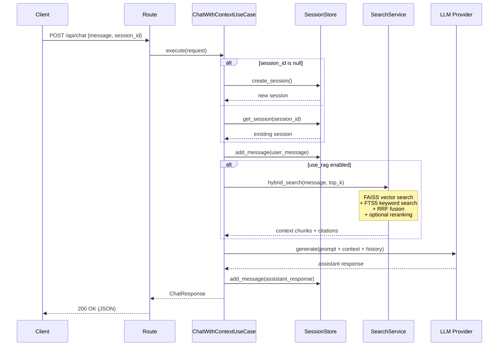
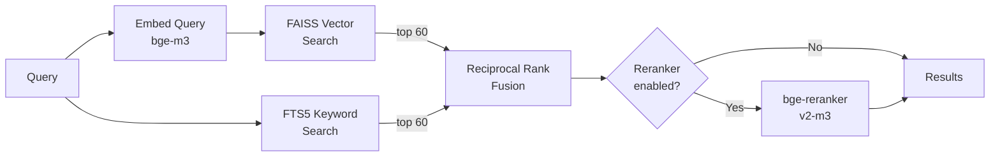
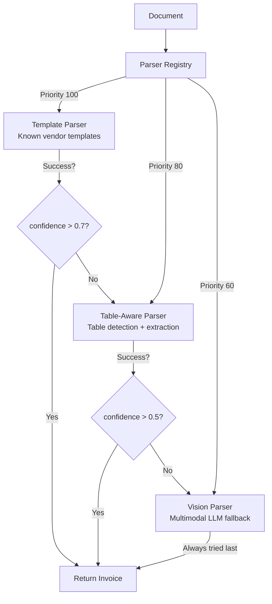
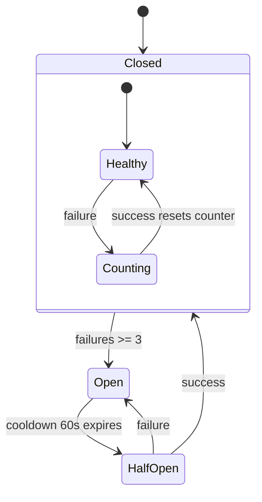
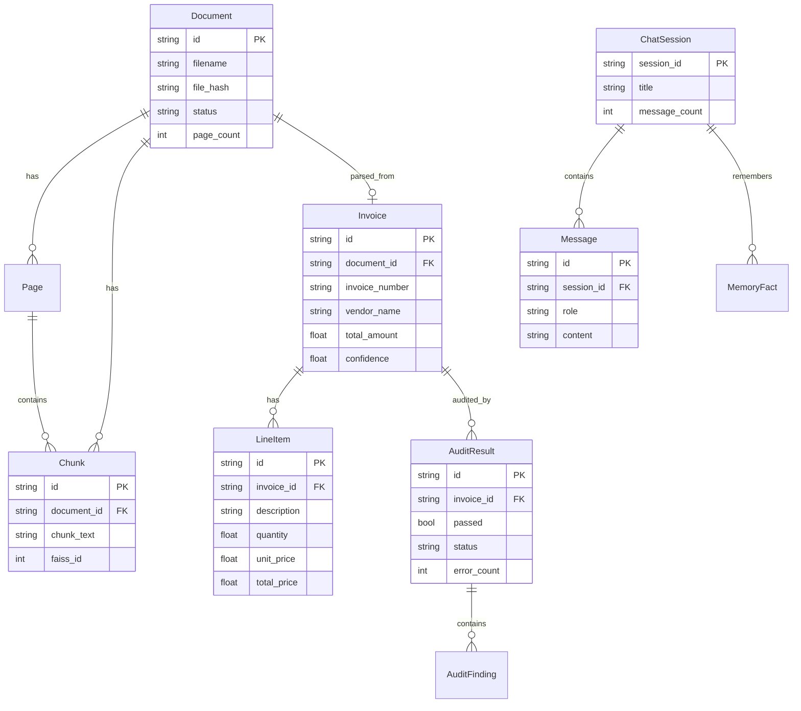
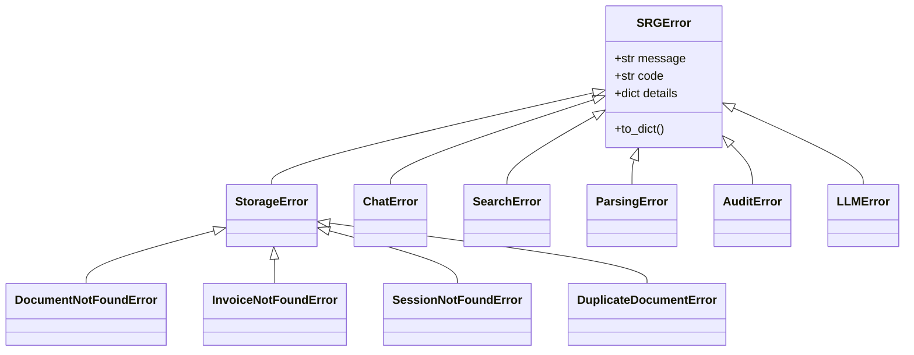

# SRG Architecture Diagrams

Visual architecture reference with Mermaid diagrams. For detailed text descriptions, see [ARCHITECTURE.md](./ARCHITECTURE.md).

---

## System Overview



---

## Clean Architecture Layers

```
┌──────────────────────────────────────────────────┐
│  API Layer (src/api/)                            │
│  FastAPI routes, middleware, dependency injection │
├──────────────────────────────────────────────────┤
│  Application Layer (src/application/)            │
│  Use cases, DTOs (request/response schemas)      │
├──────────────────────────────────────────────────┤
│  Core Layer (src/core/)                          │
│  Entities, interfaces (ABCs), domain services    │
│  *** ZERO external dependencies ***              │
├──────────────────────────────────────────────────┤
│  Infrastructure Layer (src/infrastructure/)      │
│  SQLite, FAISS, Ollama, parsers, cache           │
└──────────────────────────────────────────────────┘

  Dependencies flow INWARD only:
  API → Application → Core ← Infrastructure
```

---

## Invoice Upload Flow



---

## RAG Chat Flow



---

## Hybrid Search Pipeline



**RRF Formula**: `score(d) = Σ 1 / (k + rank_i(d))` where `k = 60` (configurable via `SEARCH_RRF_K`)

---

## Parser Registry (Strategy Pattern)



---

## LLM Circuit Breaker



---

## Entity Relationship Diagram



---

## Exception Hierarchy



---

## Technology Stack

| Component | Technology | Purpose |
|-----------|-----------|---------|
| Web Framework | FastAPI | Async HTTP API |
| Database | SQLite + aiosqlite | Structured data (27 tables) |
| Full-Text Search | SQLite FTS5 | Keyword search (BM25) |
| Vector Store | FAISS | Semantic similarity search |
| Embeddings | BAAI/bge-m3 | Multilingual embeddings (dim=1024) |
| LLM | Ollama / llama.cpp | Text generation + vision |
| Reranker | BAAI/bge-reranker-v2-m3 | Search result reranking |
| Validation | Pydantic v2 | Request/response schemas |
| Logging | structlog | Structured JSON logging |
| Dashboard | React + Vite + Tailwind | Web UI |
